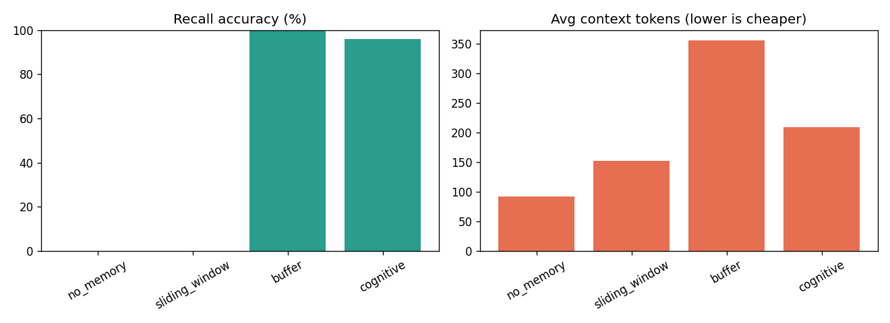
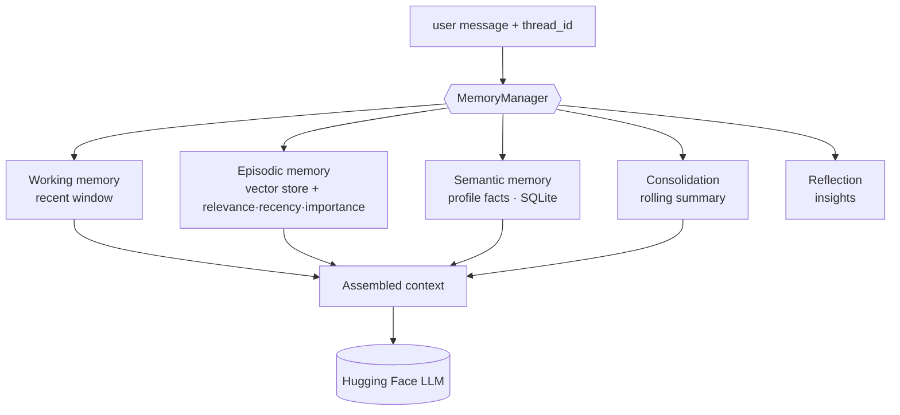

# 🧠 Aria — Multi-Turn Conversational Agent with Cognitive Memory

[](https://github.com/Akshatkhandelwal187/Multi-Turn-Conversational-Agent-with-Memory/actions/workflows/ci.yml)
[](https://www.python.org/)
[](https://github.com/astral-sh/ruff)
[](https://mypy-lang.org/)
[](LICENSE)

**Aria** is a conversational agent that *remembers*. It pairs a layered, cognitively-inspired
memory architecture (working / episodic / semantic memory, consolidation, and reflection) with a
tool-using **ReAct** loop, **document RAG**, durable persistence, and a reproducible **evaluation
harness** — built on **LangGraph** and served by free, **open-source** Hugging Face models.

It started as a ~300-line full-history-replay chatbot. This version turns it into a small research
system: memory is **retrieved**, not just replayed, so the agent recalls facts from far earlier in
a conversation — and across conversations — at a fraction of the token cost.

> **The headline result:** an [ablation study](#-results-and-evaluation) shows the cognitive memory
> matches full-history recall (**96%** vs 100%) while using **~41% fewer context tokens**, and
> crushes a bounded sliding window (**0%** on long-distance probes).

| | |
|---|---|
| **Stack** | LangGraph · LangChain · Hugging Face Inference API · sentence-transformers · NumPy · pydantic |
| **Scale** | 60 source modules · 83 tests across 18 modules · Python 3.11 / 3.12 |
| **Default model** | `Qwen/Qwen2.5-7B-Instruct` (open, ungated) |
| **License** | MIT |

---

## 📑 Table of Contents

- [🌟 Highlights](#-highlights)
- [✨ Features](#-features)
- [📊 Results and Evaluation](#-results-and-evaluation)
- [🧩 Architecture](#-architecture)
- [🧠 The Cognitive Memory Model](#-the-cognitive-memory-model)
- [🚀 Quickstart and Installation](#-quickstart-and-installation)
- [💬 Usage](#-usage)
- [🔧 Configuration Reference](#-configuration-reference)
- [📈 Observability and Metrics](#-observability-and-metrics)
- [📁 Project Structure](#-project-structure)
- [🧪 Testing and CI](#-testing-and-ci)
- [🧰 Tech Stack](#-tech-stack)
- [🧱 How It Was Built](#-how-it-was-built)
- [🧭 Roadmap and Limitations](#-roadmap-and-limitations)
- [📚 References](#-references)
- [📄 License and Acknowledgements](#-license-and-acknowledgements)

---

## 🌟 Highlights

What this project achieves, at a glance:

- **Retrieval-based memory that works.** A measured **96% recall** of facts planted far earlier in a
  conversation — matching brute-force full-history replay (100%) — at **~41% fewer context tokens**.
  A naïve bounded window scores **0%** on the same probes. (See [Results](#-results-and-evaluation).)
- **A four-tier cognitive memory.** Working, episodic, and semantic memory plus meta-cognitive
  **consolidation** (rolling summary) and **reflection** (synthesised insights) — modelled on
  *Generative Agents* and *MemGPT*.
- **Tool use that survives weak models.** A **ReAct** loop with native tool-calling *and* a robust
  **structured-JSON fallback**, so tools work even when a 7B open model ignores native tool APIs.
- **Document RAG with citations.** Upload `.txt` / `.md` / `.pdf`; answers cite `[source #chunk]`.
- **Durable by default.** A SQLite checkpointer + on-disk vector store mean memory survives restarts;
  long-term memory is **shared across conversations**, history is **per-conversation**.
- **Engineered like a product.** Installable `src/` package, typed `pydantic-settings` config,
  `structlog` logging, `tenacity` retries, Docker + compose, a Makefile, pre-commit, and a matrixed
  CI — all kept **offline** (no network, no torch needed for tests).
- **Reproducible science.** A deterministic, seeded benchmark and an ablation harness (`aria-eval`)
  that emits Markdown + CSV + a chart.

---

## ✨ Features

### Research-grade memory ([deep dive →](docs/MEMORY.md))
- **Working memory** — a token- and count-bounded window of recent turns (verbatim, always cheap).
- **Episodic memory** — every exchange is embedded into a vector store and retrieved by a
  *Generative-Agents* score combining **relevance + recency + importance**; retrieved memories are
  "touched" so attended ones stay salient.
- **Semantic memory** — durable user-profile facts (name, preferences, projects…) extracted to SQLite.
- **Consolidation** — MemGPT-style rolling summarisation bounds the context on long chats.
- **Reflection** — every *K* turns the agent synthesises higher-level insights and stores them as
  high-importance memories.

### Agent capabilities
- **ReAct tool loop** with a robust **structured-JSON fallback**: a safe **calculator**, a **clock**
  (`current_datetime`), **search-your-own-memory**, plus **document retrieval** and an optional
  web-search tool.
- **Document RAG** — uploaded files are chunked + embedded into a *separate* collection and retrieved
  with `[source #chunk]` **citations**.
- **Streaming** answers, **resumable named conversations**, and a live **memory + metrics** panel.

### Production engineering
- Durable **SQLite** checkpointer + on-disk vector store (memory survives restarts and Streamlit reruns).
- Typed **pydantic-settings** config, **structlog** logging, **tenacity** retries with typed errors.
- Installable `src/` package, **Docker** + compose, **Makefile**, **ruff + mypy + pytest-cov**,
  **pre-commit**, and a matrixed **CI** — all kept **offline** (no torch needed for tests).

### Evaluation and metrics
- A deterministic synthetic **recall benchmark** and an **ablation** comparing memory strategies,
  with Markdown/CSV reports and charts — runnable as `aria-eval`.

---

## 📊 Results and Evaluation

**Does the memory actually help?** The harness answers it empirically and reproducibly.

### Methodology

The benchmark builds synthetic, **needle-in-a-haystack** conversations:

1. **Plant** "needle" facts early — e.g. *name = Sam*, *favourite colour = teal*, *hometown = Lisbon*,
   *pet = Pixel*, *job = data scientist* (8 fact types).
2. **Bury** them under growing numbers of distractor turns, so the needle moves progressively further
   from the probe.
3. **Probe** recall at the end — *"What is my favourite colour?"* — and check whether the planted
   answer survives into the context the strategy assembles.

It is **fully deterministic** (seeded), runs **offline** (no model or network required — it measures
what each strategy puts *into context*, scored by substring + token-F1 overlap), and ships as a CLI.
The published run is **8 scenarios → 24 probes per strategy**.

Four memory strategies are compared on **recall**, **context-token cost**, and **assembly latency**:

| Strategy | What it sends to the model |
|---|---|
| `no_memory` | Only the current question (lower bound). |
| `sliding_window` | The last *N* messages — the classic bounded buffer. |
| `buffer` | The **entire** transcript replayed every turn (the gold-standard, expensive baseline). |
| **`cognitive`** | Aria's stack: persona + semantic profile + **retrieved** episodic memories + rolling summary + working window. |

### Results



| Strategy | Recall | Avg context tokens | Avg latency (ms) |
|---|---:|---:|---:|
| `no_memory` | 0% | 92 | 0.00 |
| `sliding_window` | 0% | 152 | 0.00 |
| `buffer` (full replay) | 100% | 355 | 0.01 |
| **`cognitive` (Aria)** | **96%** | **209** | 0.24 |

### Takeaways

- **Cognitive memory recalls long-distance facts like full replay** — 96% vs 100% — because it
  *retrieves* the relevant needle instead of relying on a window that has already scrolled past it.
- **At ~41% fewer context tokens** than full replay (209 vs 355). That gap *widens* as conversations
  grow, since `buffer` cost grows with the whole transcript while Aria's stays bounded.
- **The bounded sliding window fails outright (0%)** on long-distance probes — it simply forgets
  anything older than its window, which is the core problem Aria is built to solve.
- **The extra latency is negligible** (sub-millisecond here, dominated by embedding + scoring), and
  in real use is dwarfed by model inference.

Full write-up: [`docs/eval/report.md`](docs/eval/report.md) · raw numbers:
[`docs/eval/results.csv`](docs/eval/results.csv).

### Reproduce it

```bash
make eval                                   # → eval_reports/ (report.md, results.csv, ablation.png)
python -m aria.eval.runner --out eval_reports   # same; offline + deterministic
aria-eval --scenarios 12 --facts 3 --seed 0     # sweep the difficulty
```

Useful flags: `--scenarios N`, `--facts N`, `--seed N`, `--out DIR`, `--no-charts`, and `--live`
(score real model answers with an LLM-as-judge — requires a Hugging Face token).

---

## 🧩 Architecture

A multi-node **LangGraph** state machine orchestrates retrieval, the ReAct agent, persistence, and
the reflection/summarisation triggers:


The `MemoryManager` is the single seam every tier flows through:



### Request lifecycle (one turn)

1. **`retrieve_memory`** — `MemoryManager.assemble(...)` builds the system context (persona + semantic
   profile + retrieved episodic memories + rolling summary) and selects the working-memory window.
   It also increments `turn_count` and resets per-turn `usage`.
2. **`agent`** — sends `[SystemMessage(context), *working_window]` to the model. With tools enabled,
   the `ReActAgent` either emits native `tool_calls` or parses an `Action:` JSON from the model's text
   (the fallback), synthesising `tool_calls` so the `ToolNode` can execute them.
3. **`tools` ⇄ `agent`** — `tools_condition` routes tool calls to `ToolNode` and loops back, capped by
   `max_tool_iters` (the agent forces a final answer past the cap).
4. **`write_memory`** — persists the exchange to episodic memory (importance-scored), extracts profile
   facts to semantic memory, and (when persisting) flushes the vector store.
5. **`reflect`** *(conditional)* — every `K` turns, synthesises insights → high-importance memories.
6. **`summarize`** *(conditional)* — over the token budget, folds old turns into the rolling summary
   and removes them from state via `RemoveMessage`.

### State

`AriaState` ([`graph/state.py`](src/aria/graph/state.py)) is a `TypedDict`:

| field | reducer | role |
|---|---|---|
| `messages` | `add_messages` | conversation history (supports `RemoveMessage`) |
| `summary` | last-write | MemGPT rolling summary |
| `retrieved_memories` | last-write | episodic hits this turn (for the UI) |
| `profile` | last-write | semantic facts snapshot |
| `usage` | last-write | per-turn tokens / latency / tool calls |
| `turn_count` | last-write | drives reflection cadence |
| `system_context` | last-write | assembled context handed `retrieve → agent` |

### Persistence

- **Checkpointer** — a durable `SqliteSaver` (`data/checkpoints.sqlite3`) built from a *direct*
  `sqlite3` connection, constructed once and cached so conversation state survives restarts and
  Streamlit reruns.
- **Vector store** — a NumPy cosine store persisted to disk (`data/vectors/<namespace>`), with
  separate `episodic` and `docs` collections; an optional FAISS backend shares the same interface.
- **SQLite** — semantic profile facts + a reflections log (`data/aria.sqlite3`).
- **Sharing model** — long-term memory (episodic/semantic) is **shared across conversations** (your
  persistent profile); message history is **per-thread**, isolated by `thread_id`.

See [`docs/ARCHITECTURE.md`](docs/ARCHITECTURE.md) for the full component map and data flow.

---

## 🧠 The Cognitive Memory Model

Instead of replaying the whole transcript every turn (the classic `ConversationBufferMemory`), Aria
maintains a **layered memory system** and **retrieves** only what's relevant. The goal: **bounded
context** with **long-range (and cross-conversation) recall**.

### The four tiers

| Tier | Module | Role |
|---|---|---|
| **Working** | [`memory/working.py`](src/aria/memory/working.py) | Most-recent turns kept verbatim within a message-count + token budget. Fast, lossless, short-term. |
| **Episodic** | [`memory/episodic.py`](src/aria/memory/episodic.py) | Every salient utterance → a `MemoryRecord` (text, embedding, timestamp, importance, last-access, access-count) in the vector store. Retrieved top-*k* per turn. |
| **Semantic** | [`memory/semantic.py`](src/aria/memory/semantic.py) | Distilled `key → value` facts about the user in SQLite (LLM extraction + regex fallback), surfaced as a compact profile block. |
| **Meta-cognition** | [`consolidation.py`](src/aria/memory/consolidation.py) · [`reflection.py`](src/aria/memory/reflection.py) | Rolling summary (MemGPT) + periodic synthesised insights stored back as high-importance episodic memories. |

### Retrieval scoring (Generative Agents)

Following Park et al. (2023), each candidate memory *m* is scored against the query at time *now* by a
weighted sum of three components, **each min-max normalised across the candidate set**:

```
score(m) = w_rel · relevance(m) + w_rec · recency(m) + w_imp · importance(m)
```

- **relevance** — cosine similarity between the query and memory embeddings.
- **recency** — exponential decay since last access: `recency(m) = 0.5 ^ (hours_since / half_life)`.
- **importance** — a stored *poignancy* in `[0, 1]`; a fast heuristic by default (declarative,
  personal statements score higher than small talk), optionally rated by the LLM.

Retrieved memories are **"touched"** (their `last_access` / `access_count` update) so memories the
agent keeps attending to stay salient. All weights and the half-life are configurable, and the
ablation harness can sweep them.

### Assembling the prompt

`MemoryManager.assemble()` composes the final context in a fixed, legible order:

```
[ persona ]
[ Known facts about the user: … ]          ← semantic memory
[ Summary of earlier conversation: … ]     ← consolidation
[ Relevant things you remember: … ]        ← episodic retrieval (top-k)
[ recent working-memory window ]           ← working memory (incl. the new message)
```

This is the same seam the `search_memory` tool and the Streamlit memory panel read through. Full
rationale and the cognitive-science framing: [`docs/MEMORY.md`](docs/MEMORY.md).

---

## 🚀 Quickstart and Installation

### Prerequisites
- **Python 3.11+**
- A free Hugging Face **Read** token (only needed to talk to the real model) —
  create one at <https://huggingface.co/settings/tokens>.

### Quickstart

```bash
git clone https://github.com/Akshatkhandelwal187/Multi-Turn-Conversational-Agent-with-Memory.git
cd Multi-Turn-Conversational-Agent-with-Memory

python -m venv .venv && source .venv/bin/activate
pip install -e ".[app]"          # full app; or: pip install -r requirements.txt

cp .env.example .env             # add your Hugging Face token
streamlit run app.py             # → http://localhost:8501
```

The default model `Qwen/Qwen2.5-7B-Instruct` is openly accessible (no gating).

### Install variants

| Goal | Command | Notes |
|---|---|---|
| **Full app** | `pip install -e ".[app]"` | UI + sentence-transformers (torch) + PDF RAG + charts. |
| **Lightweight / offline** | `pip install -e .` + `ARIA_EMBEDDER=hashing` | No torch; uses the deterministic hashing embedder. Everything still runs. |
| **Dev / CI** | `pip install -e ".[dev]"` | pytest, ruff, mypy, pre-commit — no torch, fully offline. |
| **À la carte** | `.[embeddings]` `.[faiss]` `.[ui]` `.[rag]` `.[viz]` | Mix the extras you need. |

### Run with Docker

```bash
HUGGINGFACEHUB_API_TOKEN=hf_... docker compose up --build   # → http://localhost:8501
```

`docker-compose.yml` mounts `./data` so memory (SQLite + vectors) persists across container restarts.

### Make targets

```text
make install       # install with all runtime extras (incl. torch)
make install-dev   # dev/CI toolchain (no torch)
make run           # streamlit run app.py
make test          # pytest -q
make cov           # pytest with coverage
make lint          # ruff check
make format        # ruff format + --fix
make type          # mypy src
make check         # lint + type + cov  (the full local CI)
make eval          # memory ablation → eval_reports/
make docker        # build the image
make docker-up     # docker compose up --build
make clean         # remove caches + build artifacts
```

---

## 💬 Usage

### Try it (in the Streamlit UI)

1. *"My favourite language is Python and I'm building a recommender system."* → Aria stores it and
   extracts profile facts.
2. *"What is 21 * 19?"* → it calls the **calculator** tool.
3. …chat about other things for a while…
4. *"Based on what I told you earlier, suggest a good library."* → it **retrieves** the earlier
   context and answers (e.g. `surprise`, `implicit`, `LightFM`).
5. **Upload** a PDF in the sidebar, then ask about its contents → it answers **with citations**.
6. Start a **new conversation** — Aria still remembers your profile facts (long-term memory is shared
   across conversations; history is per-conversation).

### Programmatic API

The advanced agent is one call. `build_cognitive_agent()` returns an `AriaAgent` that proxies the
LangGraph runnable (`.invoke` / `.stream` / `.get_state`) and also exposes the live `MemoryManager`:

```python
from aria import build_cognitive_agent
from langchain_core.messages import HumanMessage

agent = build_cognitive_agent()                       # configured HF model + durable memory
config = {"configurable": {"thread_id": "alice"}}     # a conversation id

agent.invoke({"messages": [HumanMessage("My favourite language is Python.")]}, config=config)
reply = agent.invoke(
    {"messages": [HumanMessage("What did I say my favourite language was?")]},
    config=config,
)
print(reply["messages"][-1].content)                  # → "...Python..."

# Inspect what the agent remembers
print(agent.manager.semantic.facts())                 # distilled profile facts (dict)
```

Run it **offline** by injecting a fake chat model (no token, no network) — see
[`src/aria/models/fakes.py`](src/aria/models/fakes.py):

```python
from aria import build_cognitive_agent
from aria.models.fakes import ScriptedModel

agent = build_cognitive_agent(model=ScriptedModel(["Hi! How can I help?"]))
```

The **original public API is preserved** — the legacy shim still works and the original tests pass
unchanged:

```python
from agent import build_agent, build_cognitive_agent, SYSTEM_PERSONA, DEFAULT_MODEL, build_model
```

---

## 🔧 Configuration Reference

Every knob is a typed setting read from the environment (prefix `ARIA_`) or a `.env` file — see
[`src/aria/config.py`](src/aria/config.py) and [`.env.example`](.env.example). The Hugging Face token
is read from the conventional `HUGGINGFACEHUB_API_TOKEN` (or `ARIA_HF_TOKEN`).

### Language model
| Setting | Default | Purpose |
|---|---|---|
| `HUGGINGFACEHUB_API_TOKEN` | — | HF Inference API token (required for the real model). |
| `ARIA_HF_MODEL` | `Qwen/Qwen2.5-7B-Instruct` | Chat model repo id. |
| `ARIA_HF_PROVIDER` | `auto` | HF inference-provider routing. |
| `ARIA_TEMPERATURE` | `0.7` | Sampling temperature (0–2). |
| `ARIA_MAX_NEW_TOKENS` | `512` | Max generated tokens. |
| `ARIA_REQUEST_MAX_RETRIES` | `3` | Tenacity retry attempts. |
| `ARIA_REQUEST_RETRY_BASE_DELAY` | `0.5` | Retry backoff base (seconds). |

### Embeddings and vector store
| Setting | Default | Purpose |
|---|---|---|
| `ARIA_EMBEDDER` | `hashing` | `hashing` (offline, no torch) or `sentence_transformer`. |
| `ARIA_ST_MODEL_NAME` | `sentence-transformers/all-MiniLM-L6-v2` | Embedding model (384-dim) when ST is enabled. |
| `ARIA_HASHING_DIM` | `256` | Dimension of the hashing embedder. |
| `ARIA_VECTOR_BACKEND` | `numpy` | `numpy` cosine store (default) or `faiss`. |

> The `.env.example` template ships with `ARIA_EMBEDDER=sentence_transformer` because the full
> `[app]` install includes it; the code default is `hashing` so a bare install stays torch-free.

### Memory tuning
| Setting | Default | Purpose |
|---|---|---|
| `ARIA_WORKING_WINDOW_MESSAGES` | `12` | Max recent messages kept verbatim. |
| `ARIA_WORKING_WINDOW_TOKENS` | `1500` | Token budget for the working window. |
| `ARIA_EPISODIC_TOP_K` | `4` | Memories retrieved per turn. |
| `ARIA_RELEVANCE_WEIGHT` | `1.0` | Weight on cosine relevance. |
| `ARIA_RECENCY_WEIGHT` | `1.0` | Weight on recency. |
| `ARIA_IMPORTANCE_WEIGHT` | `1.0` | Weight on importance. |
| `ARIA_RECENCY_HALF_LIFE_HOURS` | `24` | Recency exponential-decay half-life. |
| `ARIA_SUMMARY_TOKEN_BUDGET` | `2000` | Consolidation trigger threshold. |
| `ARIA_SUMMARY_KEEP_LAST_MESSAGES` | `6` | Messages kept after summarising. |
| `ARIA_REFLECTION_EVERY_K_TURNS` | `4` | Reflection cadence (`0` disables). |
| `ARIA_REFLECTION_TOP_MEMORIES` | `15` | Memories considered when reflecting. |

### Tools and RAG
| Setting | Default | Purpose |
|---|---|---|
| `ARIA_ENABLE_TOOLS` | `true` | Attach the ReAct tool loop. |
| `ARIA_MAX_TOOL_ITERS` | `4` | ReAct loop guard. |
| `ARIA_PREFER_NATIVE_TOOL_CALLS` | `true` | Try native `bind_tools` before the JSON fallback. |
| `ARIA_ENABLED_TOOLS` | `calculator,current_datetime,search_memory` | Base toolset (RAG attaches when docs are indexed). |
| `ARIA_CHUNK_SIZE` | `800` | RAG chunk size. |
| `ARIA_CHUNK_OVERLAP` | `120` | RAG chunk overlap. |
| `ARIA_RAG_TOP_K` | `4` | Document chunks retrieved per query. |

### Persistence and logging
| Setting | Default | Purpose |
|---|---|---|
| `ARIA_DATA_DIR` | `data` | Root for SQLite + vectors. |
| `ARIA_PERSIST` | `true` | Durable SQLite + on-disk vectors (vs in-memory). |
| `ARIA_LOG_LEVEL` | `INFO` | Log level. |
| `ARIA_LOG_JSON` | `false` | Emit structured JSON logs. |

---

## 📈 Observability and Metrics

Every turn is instrumented ([`src/aria/observability/tokens.py`](src/aria/observability/tokens.py)).
A `TurnUsage` record captures:

| Field | Meaning |
|---|---|
| `tokens_in` / `tokens_out` | Prompt and completion tokens (`tiktoken` `cl100k_base`, with a character-based fallback). |
| `total_tokens` | `tokens_in + tokens_out`. |
| `tool_calls` | Tool invocations this turn. |
| `retrieved_memories` | Episodic hits surfaced this turn. |
| `latency_ms` | Wall-clock time for the turn. |
| `reflected` / `summarized` | Whether reflection / consolidation fired. |

A `UsageTracker` aggregates these across a session (`totals()` → turns, token sums, tool calls,
average latency), and the Streamlit sidebar renders them live alongside the retrieved-memory panel so
you can *watch* the memory system work.

---

## 📁 Project Structure

```text
src/aria/
  config.py logging.py exceptions.py constants.py   # typed settings, logging, errors, public constants
  models/        # HF model factory, tenacity retry wrapper, offline fakes
  embeddings/    # Embedder protocol; hashing (default) + sentence-transformers
  vectorstore/   # cosine NumPy store (default) + optional FAISS backend
  memory/        # working · episodic · semantic · consolidation · reflection · importance · manager
  graph/         # AriaState, nodes, ReAct loop, checkpointer, cognitive graph builder
  tools/         # calculator · current_datetime · search_memory · retrieve_documents · web_search
  rag/           # loaders (.txt/.md/.pdf) · chunker · document index
  observability/ # token counting · per-turn usage tracking · timing
  eval/          # benchmark · scorer · ablation · report · runner (aria-eval CLI)
  ui/            # Streamlit app + conversation registry
tests/           # 83 offline tests across 18 modules (fakes + deterministic embedder) + gated live tests
docs/            # ARCHITECTURE.md · MEMORY.md · eval/ (sample report, results.csv, chart)
app.py           # Streamlit entrypoint → aria.ui.streamlit_app.main
agent.py         # backward-compatibility shim (preserves the original import surface)
```

The original public API is preserved: `from agent import build_agent, SYSTEM_PERSONA` still works.

---

## 🧪 Testing and CI

The suite is **offline-first**: chat models are injected fakes (`ScriptedModel`, `RecordingModel`,
`FlakyModel`) and the default embedder is the deterministic `HashingEmbedder`, so **no network and no
torch are required**. **83 tests across 18 modules** cover every component — memory tiers, the
LangGraph nodes, the ReAct JSON fallback, RAG, the vector store (NumPy + FAISS), observability, the UI,
and the evaluation harness.

```bash
pytest -q                                       # offline suite
pytest --cov=aria --cov-report=term-missing     # with coverage
pytest -m live                                  # opt-in real HF round-trips (needs a token)
make check                                      # ruff + mypy + pytest --cov (full local CI)
```

**CI** ([`.github/workflows/ci.yml`](.github/workflows/ci.yml)) runs on **Python 3.11 and 3.12**:
`ruff check` + `ruff format --check`, `mypy src`, `pytest --cov --cov-fail-under=70`, and a **smoke
run** of the ablation harness (`--scenarios 4 --no-charts`). Live Hugging Face tests are marked and
**auto-skip** without a token. Pre-commit hooks (`.pre-commit-config.yaml`) mirror the lint/type
checks locally.

---

## 🧰 Tech Stack

| Component | Library | Role |
|---|---|---|
| Orchestration | **LangGraph** (`>=1.2,<2`) | Typed state machine, conditional edges, checkpointing. |
| Chat model | **langchain-huggingface** (`>=1.2,<2`) | `ChatHuggingFace` over the HF Inference API. |
| Messages / core | **langchain-core** (`>=1.4,<2`) | Message types and runnables. |
| Checkpointing | **langgraph-checkpoint-sqlite** (`>=3.1,<4`) | Durable per-thread conversation state. |
| Config | **pydantic-settings** (`>=2.3,<3`) | Typed, env-driven settings. |
| Embeddings | **sentence-transformers** (`>=3.0`, optional) | Real semantics (else deterministic hashing). |
| Vectors | **NumPy** (`>=1.26`) / **faiss-cpu** (optional) | Cosine search + on-disk persistence. |
| Tokens | **tiktoken** (`>=0.7`) | Token accounting. |
| Resilience | **tenacity** (`>=8.3,<10`) | Backoff + typed errors. |
| Logging | **structlog** (`>=24.1`) | Structured logs. |
| UI | **Streamlit** (`>=1.40`) | Chat interface, RAG upload, metrics panel. |
| RAG | **pypdf** (`>=4.2`) | PDF/text loading. |
| Charts | **matplotlib** (`>=3.8`) | Ablation visualisations. |
| Quality | **ruff**, **mypy**, **pytest** + **pytest-cov**, **pre-commit** | Lint, types, tests. |

Upper bounds are pinned in [`pyproject.toml`](pyproject.toml) to avoid silent major-version drift.

---

## 🧱 How It Was Built

Aria grew from a ~300-line chatbot into a research system in disciplined, reviewable phases — each one
a self-contained, tested increment:

| Phase | Delivered |
|---|---|
| **P0** | Scaffold the installable `aria` package with a backward-compatibility shim. |
| **P1** | Embeddings, the vector store, and observability primitives. |
| **P2** | The cognitively-inspired layered memory system. |
| **P3** | The cognitive **LangGraph** with durable, resumable memory. |
| **P4** | The **ReAct** tool loop with a robust structured-JSON fallback. |
| **P5** | Document **RAG** with cited retrieval. |
| **P6** | An upgraded **Streamlit** UI — streaming, conversations, RAG upload, metrics. |
| **P7** | The **evaluation harness** and the memory-strategy ablation study. |
| **P8** | Production hardening, packaging, Docker, and documentation. |

---

## 🧭 Roadmap and Limitations

Honest scope notes:

- The published evaluation is a **single ablation** (8 scenarios, 24 probes/strategy). It measures
  *context recall* deterministically (substring + token-F1), not generation quality — there are no
  BLEU/ROUGE scores. Real end-to-end model answers are gated behind `--live` (LLM-as-judge).
- Default offline embeddings are the **hashing** embedder (great for determinism and tests, weaker
  semantics than `sentence_transformer`). Enable the `[embeddings]` extra for real semantics.
- Fact extraction / importance / summarisation are **heuristic-first** with optional LLM upgrades, so
  ordinary turns stay cheap and tests stay deterministic.
- Natural extensions: larger ablation sweeps and parameter grids, additional tools, alternative vector
  backends, and multi-user memory partitioning.

---

## 📚 References

Aria's memory design draws on:

- Park et al. (2023), *Generative Agents: Interactive Simulacra of Human Behavior* — memory stream,
  reflection, and relevance·recency·importance retrieval. [arXiv:2304.03442](https://arxiv.org/abs/2304.03442)
- Packer et al. (2023), *MemGPT: Towards LLMs as Operating Systems* — tiered memory & context paging.
  [arXiv:2310.08560](https://arxiv.org/abs/2310.08560)
- Yao et al. (2023), *ReAct: Synergizing Reasoning and Acting in Language Models*.
  [arXiv:2210.03629](https://arxiv.org/abs/2210.03629)
- Lewis et al. (2020), *Retrieval-Augmented Generation for Knowledge-Intensive NLP Tasks*.
  [arXiv:2005.11401](https://arxiv.org/abs/2005.11401)

---

## 📄 License and Acknowledgements

Released under the **MIT** License — see [LICENSE](LICENSE).

Built on the open-source ecosystem: **LangGraph** / **LangChain**, **Hugging Face** open models and
the Inference API, **sentence-transformers**, **FAISS**, **Streamlit**, and the Python scientific
stack. Memory design inspired by the *Generative Agents*, *MemGPT*, *ReAct*, and *RAG* papers above.
