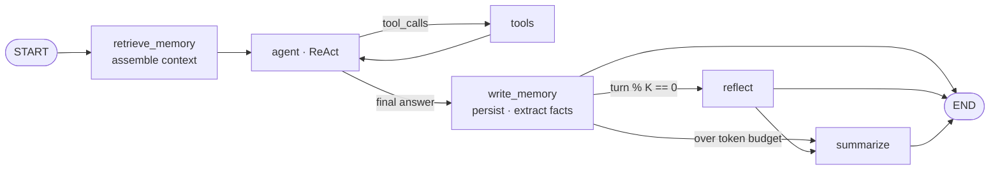
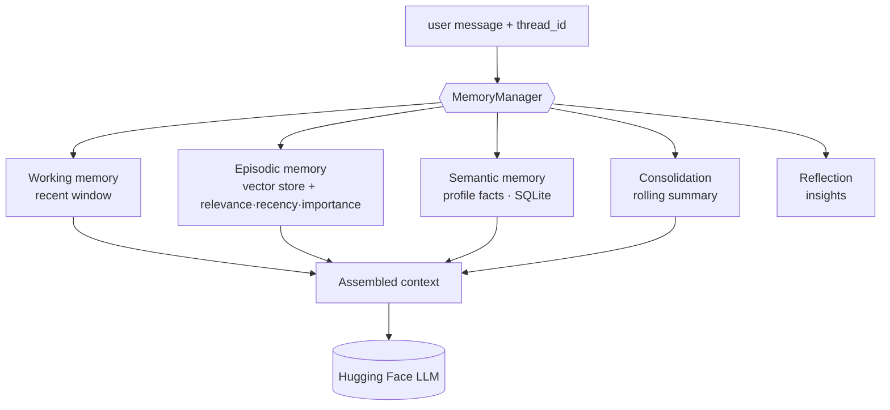

# 🧠 Aria — Multi-Turn Conversational Agent with Cognitive Memory

[](https://github.com/Akshatkhandelwal187/Multi-Turn-Conversational-Agent-with-Memory/actions/workflows/ci.yml)
[](https://www.python.org/)
[](https://github.com/astral-sh/ruff)
[](https://mypy-lang.org/)
[](LICENSE)

**Aria** is a conversational agent that *remembers*. It pairs a layered, cognitively-inspired
memory architecture (working / episodic / semantic memory, consolidation, and reflection) with a
tool-using **ReAct** loop, **document RAG**, durable persistence, and a reproducible **evaluation
harness** — built on **LangGraph** and served by free, **open-source** Hugging Face models.

It started as a ~300-line full-history-replay chatbot. This version turns it into a small research
system: memory is **retrieved**, not just replayed, so the agent recalls facts from far earlier in
a conversation — and across conversations — at a fraction of the token cost.

> **Why it's interesting:** an [ablation study](#-does-the-memory-actually-help-evaluation) shows the
> cognitive memory matches full-history recall (**96%** vs 100%) while using **~41% fewer context
> tokens**, and crushes a bounded sliding window (**0%** on long-distance probes).

---

## ✨ Features

**Research-grade memory** ([deep dive](docs/MEMORY.md))
- **Working memory** — a token- and count-bounded window of recent turns.
- **Episodic memory** — every exchange is embedded into a vector store and retrieved by a
  *Generative-Agents* score combining **relevance + recency + importance**; retrieved memories are
  "touched" so attended ones stay salient.
- **Semantic memory** — durable user-profile facts (name, preferences, projects…) extracted to SQLite.
- **Consolidation** — MemGPT-style rolling summarisation bounds the context on long chats.
- **Reflection** — every *K* turns the agent synthesises higher-level insights and stores them.

**Agent capabilities**
- **ReAct tool loop** with a robust **structured-JSON fallback** (so it works even when a 7B model
  ignores native tool-calling): a safe calculator, a clock, **search-your-own-memory**, and RAG.
- **Document RAG** — upload `.txt` / `.md` / `.pdf`, chunked + embedded into a separate collection,
  retrieved with `[source #chunk]` **citations**.
- **Streaming** answers, **resumable named conversations**, and a live **memory + metrics** panel.

**Production engineering**
- Durable **SQLite** checkpointer + on-disk vector store (memory survives restarts).
- Typed **pydantic-settings** config, **structlog** logging, **tenacity** retries with typed errors.
- Installable `src/` package, **Docker** + compose, **Makefile**, **ruff + mypy + pytest-cov**,
  **pre-commit**, and a matrixed **CI** — all kept **offline** (no torch needed for tests).

**Evaluation & metrics**
- A deterministic synthetic **recall benchmark** and an **ablation** comparing memory strategies,
  with Markdown/CSV reports and charts — runnable as `aria-eval`.

---

## 🧩 Architecture

A multi-node LangGraph orchestrates retrieval, the ReAct agent, persistence, and the
reflection/summarisation triggers:



The `MemoryManager` is the single seam every tier flows through:



See [`docs/ARCHITECTURE.md`](docs/ARCHITECTURE.md) for the full component map and data flow.

---

## 📊 Does the memory actually help? (Evaluation)

The harness plants "needle" facts early in synthetic conversations, buries them under growing
distractor distances, then probes recall — comparing four memory strategies on **recall**, **token
cost**, and **latency**. Reproduce it with `python -m aria.eval.runner` (offline, deterministic):


| Strategy | Recall | Avg context tokens | Avg latency (ms) |
|---|---:|---:|---:|
| `no_memory` | 0% | 92 | 0.00 |
| `sliding_window` | 0% | 152 | 0.00 |
| `buffer` (full replay) | 100% | 355 | 0.01 |
| **`cognitive` (Aria)** | **96%** | **209** | 0.24 |

**Cognitive memory recalls long-distance facts like full replay, at ~41% fewer tokens — and the
bounded sliding window misses them entirely.** Full report: [`docs/eval/report.md`](docs/eval/report.md).

---

## 🚀 Quickstart

```bash
git clone https://github.com/Akshatkhandelwal187/Multi-Turn-Conversational-Agent-with-Memory.git
cd Multi-Turn-Conversational-Agent-with-Memory

python -m venv .venv && source .venv/bin/activate
pip install -e ".[app]"          # full app (incl. sentence-transformers); or: pip install -r requirements.txt

cp .env.example .env             # add your Hugging Face token
streamlit run app.py
```

Create a free **Read** token at <https://huggingface.co/settings/tokens>. The default model
`Qwen/Qwen2.5-7B-Instruct` is openly accessible. Prefer a lighter, fully-offline setup? Install
`pip install -e .` and set `ARIA_EMBEDDER=hashing` — everything still runs, using the deterministic
hashing embedder.

**Run with Docker:**

```bash
HUGGINGFACEHUB_API_TOKEN=hf_... docker compose up --build   # http://localhost:8501
```

**Run the evaluation / tests:**

```bash
make eval         # writes eval_reports/ (report.md, results.csv, ablation.png)
make check        # ruff + mypy + pytest --cov  (no token, no network)
```

---

## 🕹️ Try it

1. *"My favorite language is Python and I'm building a recommender system."* → Aria stores it (and
   extracts profile facts).
2. *"What is 21 * 19?"* → it calls the **calculator** tool.
3. …chat about other things for a while…
4. *"Based on what I told you earlier, suggest a good library."* → it **retrieves** the earlier
   context and answers (e.g. `surprise`, `implicit`, `LightFM`).
5. Upload a PDF in the sidebar, then ask about its contents → it answers **with citations**.
6. Start a **new conversation** — Aria still remembers your profile facts (long-term memory is shared
   across conversations; history is per-conversation).

---

## ⚙️ Configuration

Every knob is a typed setting (env prefix `ARIA_`, or a `.env` file) — see
[`aria/config.py`](src/aria/config.py) and [`.env.example`](.env.example). Highlights:

| Setting | Default | Purpose |
|---|---|---|
| `ARIA_HF_MODEL` | `Qwen/Qwen2.5-7B-Instruct` | Chat model repo id |
| `ARIA_EMBEDDER` | `hashing` | `hashing` (offline) or `sentence_transformer` |
| `ARIA_EPISODIC_TOP_K` | `4` | Memories retrieved per turn |
| `ARIA_{RELEVANCE,RECENCY,IMPORTANCE}_WEIGHT` | `1.0` | Retrieval scoring weights |
| `ARIA_REFLECTION_EVERY_K_TURNS` | `4` | Reflection cadence (`0` disables) |
| `ARIA_SUMMARY_TOKEN_BUDGET` | `2000` | Consolidation trigger |
| `ARIA_MAX_TOOL_ITERS` | `4` | ReAct loop guard |
| `ARIA_PERSIST` | `true` | Durable SQLite + on-disk vectors |

---

## 🗂️ Project structure

```
src/aria/
  config.py logging.py exceptions.py constants.py
  models/        # HF factory, retry wrapper, offline fakes
  embeddings/    # Embedder protocol; hashing (default) + sentence-transformers
  vectorstore/   # cosine numpy store (default) + optional FAISS
  memory/        # working · episodic · semantic · consolidation · reflection · manager
  graph/         # AriaState, nodes, ReAct loop, checkpointer, cognitive graph
  tools/         # calculator · datetime · search_memory · retrieve_documents · web_search
  rag/           # loaders · chunker · document index
  observability/ # token counting · usage tracking · timing
  eval/          # benchmark · scorer · ablation · report · runner (aria-eval)
  ui/            # Streamlit app + conversation registry
tests/           # 80+ offline tests (fakes + deterministic embedder) + gated live tests
docs/            # ARCHITECTURE.md · MEMORY.md · eval/ (sample report + chart)
```

The original public API is preserved: `from agent import build_agent, SYSTEM_PERSONA` still works,
and the original tests pass unchanged.

---

## 🧪 Testing & CI

The suite is **offline-first**: language models are injected fakes and the default embedder is the
deterministic hashing embedder, so **no network or torch is required**. CI runs `ruff` (lint +
format), `mypy`, and `pytest --cov` on Python 3.11/3.12, plus a smoke run of the ablation. Live
Hugging Face tests are marked and auto-skip without a token.

```bash
pytest -q                 # offline suite
pytest -m live            # opt-in live HF round-trips (needs a token)
```

---

## 📚 References

Aria's memory design draws on:

- Park et al. (2023), *Generative Agents: Interactive Simulacra of Human Behavior* — memory stream,
  reflection, and relevance·recency·importance retrieval. [arXiv:2304.03442](https://arxiv.org/abs/2304.03442)
- Packer et al. (2023), *MemGPT: Towards LLMs as Operating Systems* — tiered memory & context paging.
  [arXiv:2310.08560](https://arxiv.org/abs/2310.08560)
- Yao et al. (2023), *ReAct: Synergizing Reasoning and Acting in Language Models*.
  [arXiv:2210.03629](https://arxiv.org/abs/2210.03629)
- Lewis et al. (2020), *Retrieval-Augmented Generation for Knowledge-Intensive NLP Tasks*.
  [arXiv:2005.11401](https://arxiv.org/abs/2005.11401)

## 🛠️ Tech stack

LangGraph · LangChain · Hugging Face Inference API · sentence-transformers · NumPy · pydantic ·
structlog · tenacity · Streamlit · pytest · ruff · mypy.

## 📄 License

MIT — see [LICENSE](LICENSE).
