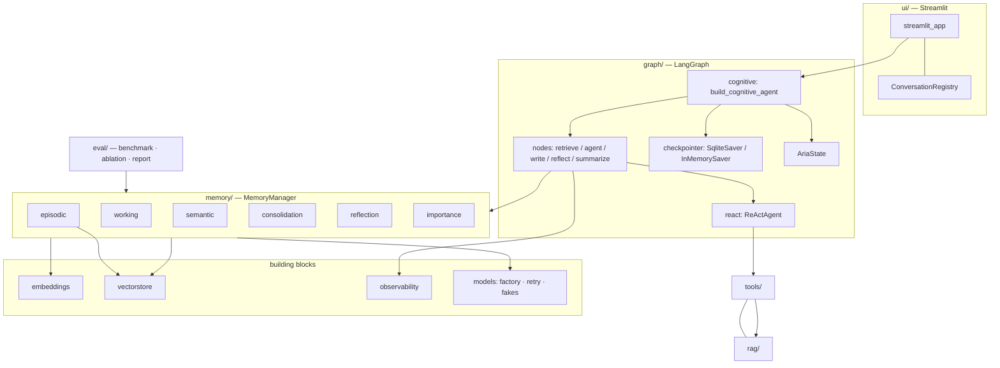

# Architecture

Aria is an installable `src/`-layout package (`aria`) composed of small, single-responsibility
modules wired together by a LangGraph state machine. This document maps the components and traces a
request end-to-end.

## Component map

## Request lifecycle (one turn)

1. **`retrieve_memory`** — `MemoryManager.assemble(messages, query, summary)` builds the system
   context = persona + semantic profile + retrieved episodic memories + rolling summary, and selects
   the working-memory window. It also increments `turn_count` and resets per-turn `usage`.
2. **`agent`** — sends `[SystemMessage(context), *working_window]` to the model. With tools enabled,
   the `ReActAgent` either emits native `tool_calls` or parses an `Action:` JSON from the model's
   text (the fallback path), synthesising `tool_calls` so `ToolNode` executes them.
3. **`tools` ⇄ `agent`** — `tools_condition` routes tool calls to `ToolNode` and loops back, capped by
   `max_tool_iters` (the agent node forces a final answer past the cap).
4. **`write_memory`** — persists the exchange to episodic memory (importance-scored), extracts profile
   facts to semantic memory, and (when persisting) flushes the vector store.
5. **`reflect`** *(conditional)* — every `K` turns, synthesises insights → high-importance memories.
6. **`summarize`** *(conditional)* — over the token budget, folds old turns into the rolling summary
   and removes them from state via `RemoveMessage`.

## State

`AriaState` (`graph/state.py`) is a `TypedDict`:

| field | reducer | role |
|---|---|---|
| `messages` | `add_messages` | conversation history (supports `RemoveMessage`) |
| `summary` | last-write | MemGPT rolling summary |
| `retrieved_memories` | last-write | episodic hits this turn (for the UI) |
| `profile` | last-write | semantic facts snapshot |
| `usage` | last-write | per-turn tokens / latency / tool calls (accumulated by nodes) |
| `turn_count` | last-write | drives reflection cadence |
| `system_context` | last-write | assembled context handed retrieve → agent |

## Persistence

- **Checkpointer** — durable `SqliteSaver` built from a *direct* `sqlite3` connection
  (`check_same_thread=False`), constructed once and cached so conversation state survives restarts
  and Streamlit reruns. (`from_conn_string` is deliberately avoided — it closes the DB on exit.)
- **Vector store** — a numpy cosine store persisted to disk (`data/vectors/<namespace>`), with
  separate `episodic` and `docs` collections; an optional FAISS backend shares the same interface.
- **SQLite** — semantic facts + a reflections log.
- Long-term memory (episodic/semantic) is **shared across conversations** (the user's persistent
  memory); message history is **per-thread**.

## Testing & resilience

- **Offline-first:** chat models are injected fakes (`ScriptedModel`, `RecordingModel`, `FlakyModel`)
  and the default embedder is the deterministic `HashingEmbedder`, so the whole suite runs with no
  network and no torch.
- **Resilience:** `RetryingChatModel` adds tenacity backoff + typed `ModelError`; the structured-JSON
  ReAct path and heuristic fallbacks (importance, fact-extraction, summary) keep the system working
  even when the model returns prose instead of JSON.

## Tested dependency matrix

`langgraph 1.2` · `langgraph-checkpoint-sqlite 3.1` · `langchain-core 1.4` ·
`langchain-huggingface 1.2` · `pydantic 2` · Python 3.11/3.12. Upper bounds are pinned in
`pyproject.toml` to avoid silent major-version drift.
