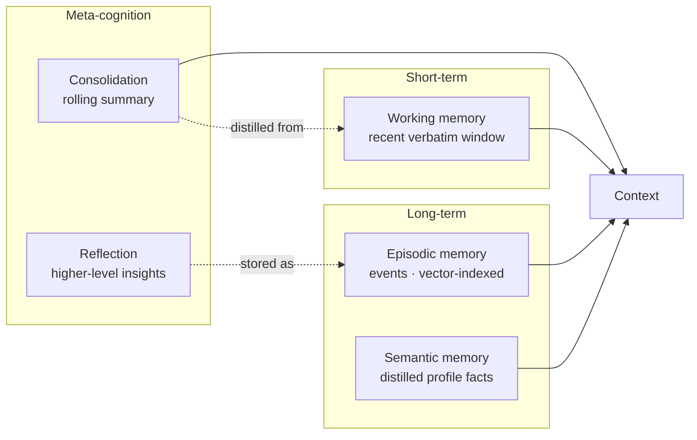

# The Cognitive Memory Model

Aria's memory is the heart of the project. Instead of replaying the entire transcript every turn
(the classic `ConversationBufferMemory` approach), it maintains a **layered memory system** inspired
by human cognition and recent LLM-agent research, and **retrieves** what's relevant. This document
explains each tier, the retrieval mathematics, and the design rationale.

## Why not just replay everything?

Full-history replay recalls perfectly but its cost grows linearly with the conversation: every turn
re-sends every prior token, which is slow, expensive, and eventually overflows the context window. A
fixed sliding window bounds the cost but *forgets* anything older than the window. Aria aims for the
best of both: **bounded context** with **long-range (and cross-conversation) recall** — confirmed
empirically in the [ablation](eval/report.md).

## The four tiers



### 1. Working memory (`memory/working.py`)
The most recent turns, kept verbatim within a **message-count and token budget**. This is fast,
loss-less short-term context — always present, always cheap.

### 2. Episodic memory (`memory/episodic.py`)
Every salient utterance becomes a `MemoryRecord` (text, embedding, timestamp, importance,
last-access, access-count) in a vector store. At each turn the agent **retrieves** the top-k records
for the current query. This is what enables recall of facts far outside the working window.

### 3. Semantic memory (`memory/semantic.py`, `store_sqlite.py`)
Durable, *distilled* knowledge about the user — name, preferences, projects, goals — as `key → value`
facts in SQLite. Facts are extracted from each message by the LLM (strict JSON) with a deterministic
regex fallback, and surfaced as a compact **profile block**. Unlike episodic events, semantic facts
are stable and de-duplicated.

### 4. Meta-cognition: consolidation & reflection
- **Consolidation** (`consolidation.py`) — MemGPT-style: when the working set + summary exceeds a
  token budget, the oldest turns are folded into a **rolling summary** and dropped from state, so the
  live context stays bounded no matter how long the conversation runs.
- **Reflection** (`reflection.py`) — every *K* turns the agent steps back and asks the model to infer
  a few **higher-level insights** from recent memories (e.g. *"the user is an ML practitioner focused
  on recommender systems"*). Insights are stored as high-importance episodic memories, so they surface
  readily later — knowledge no single message contained.

## Retrieval scoring (Generative Agents)

Following Park et al. (2023), each candidate memory *m* is scored against the query at time *now* by a
weighted sum of three components, **each min-max normalised across the candidate set**:

```
score(m) = w_rel · relevance(m) + w_rec · recency(m) + w_imp · importance(m)
```

- **relevance** — cosine similarity between the query embedding and the memory embedding.
- **recency** — exponential decay since the memory was last accessed:
  `recency(m) = 0.5 ^ (hours_since_last_access / half_life)`.
- **importance** — a stored *poignancy* in `[0, 1]`; by default a fast heuristic (personal,
  declarative statements score higher than small talk), optionally rated by the LLM (1–10).

Retrieved memories are **"touched"** — their `last_access` and `access_count` update — so memories the
agent keeps attending to remain recent and salient, a small but faithful piece of the cognitive model.
The weights and half-life are configurable (`ARIA_RELEVANCE_WEIGHT`, `ARIA_RECENCY_HALF_LIFE_HOURS`,
…), and the ablation harness can sweep them.

## Assembling the prompt

`MemoryManager.assemble()` composes the final context in a fixed, legible order:

```
[ persona ]
[ Known facts about the user: … ]          ← semantic memory
[ Summary of earlier conversation: … ]     ← consolidation
[ Relevant things you remember: … ]        ← episodic retrieval (top-k)
[ recent working-memory window ]           ← working memory (incl. the new message)
```

This is the single seam the `search_memory` tool and the Streamlit memory panel also read through.

## Design rationale

- **Separation of episodic vs semantic** mirrors cognitive science (events vs distilled knowledge) and
  is practical: episodic retrieval handles "what did I say about X?", while the semantic profile gives
  the model a stable who-is-this-user header every turn.
- **Heuristic-first, LLM-optional** memory operations keep ordinary turns cheap and make tests
  deterministic, while still allowing LLM-quality importance/extraction/summarisation/reflection when a
  model is available.
- **Shared long-term, isolated short-term** — episodic/semantic memory persists across conversations
  (a personal assistant should remember you), while each conversation's message history is isolated by
  `thread_id` via the checkpointer.

## References

- Park, J. S., O'Brien, J., Cai, C. J., Morris, M. R., Liang, P., & Bernstein, M. S. (2023).
  *Generative Agents: Interactive Simulacra of Human Behavior.* [arXiv:2304.03442](https://arxiv.org/abs/2304.03442)
- Packer, C., Wooders, S., Lin, K., Fang, V., Patil, S. G., Stoica, I., & Gonzalez, J. E. (2023).
  *MemGPT: Towards LLMs as Operating Systems.* [arXiv:2310.08560](https://arxiv.org/abs/2310.08560)
- Yao, S., Zhao, J., Yu, D., Du, N., Shafran, I., Narasimhan, K., & Cao, Y. (2023).
  *ReAct: Synergizing Reasoning and Acting in Language Models.* [arXiv:2210.03629](https://arxiv.org/abs/2210.03629)
- Lewis, P., et al. (2020). *Retrieval-Augmented Generation for Knowledge-Intensive NLP Tasks.*
  [arXiv:2005.11401](https://arxiv.org/abs/2005.11401)
